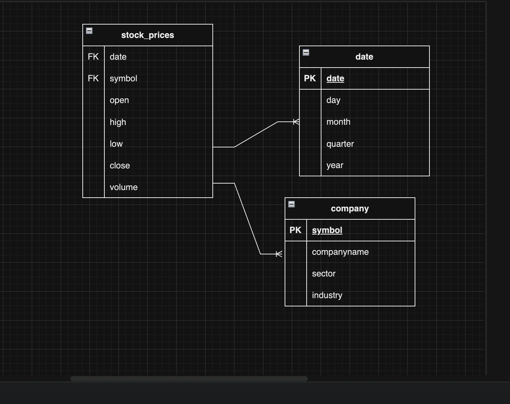

# Data-eng-project
My first data engineering project.

This project creates a financial data dashboard that integrates different financial data sources and provide real time visualisations using python, SQL and AWS. 

# Tools and Technologies 
- Language: Python
- Data Collection: AWS Lambda, 
- Data Storage:
- Data Processing:
- Visualisation: 
- Deployment: 

<br>
<br> 

# Install libraries from the requirements file 
- In a terminal, run pip install requirements.txt to install all the necessary libraries in the [requirements]('src/requiremts.txt') file 

<br> 
<br> 

# Financial API
For this project, I've chosen to use the [Alpha Vantage]('https://www.alphavantage.co/) API to extract financial data. Alpha Vantage provides realtime and historical financial market data through a set of powerful and developer-friendly data APIs and spreadsheets.

<br> 
<br> 

# Test Folder
The [test](/test/) folder contains the tests for each function in this project. To run a test, type either of the following into the terminal:

- ``` python 3 -m pytest -v -s ```
- ``` pytest (filename.py) (make sure to put on the right file path if not in the test folder)```

<br>
<br>

# Database Schema 

The database schema can be found by following this [link]('https://drive.google.com/file/d/1me_G8aTfo1tUZuwPfMaHOpmg3TxUsmQJ/view?usp=sharing')

- 

<br>
<br>


