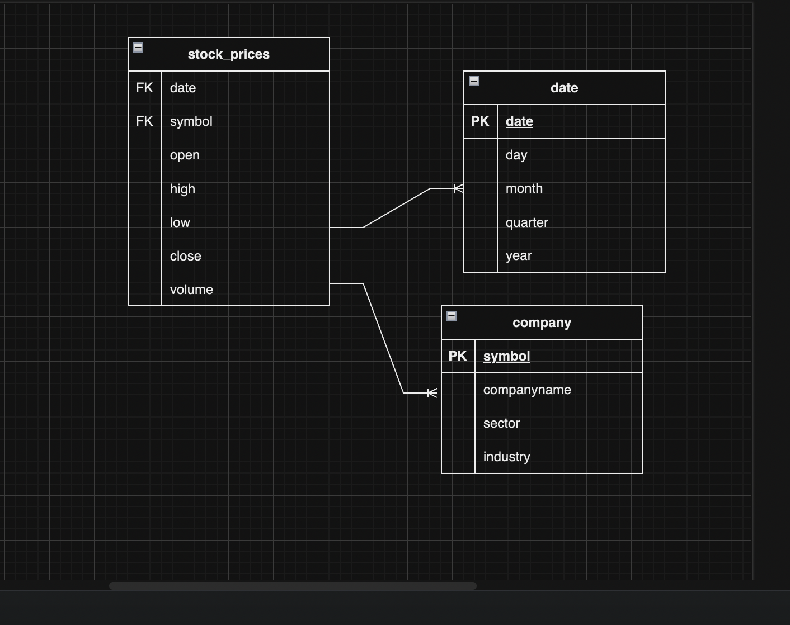

# Data-eng-project
My first data engineering project.


# Project Overview
This project builds a financial data dashboard that integrates real-time and historical data from multiple financial data sources. It provides:

- Automated data collection (ETL pipeline).
- Data storage in a MySQL database (using Docker).
- Real-time financial data visualizations.

# Features
- Fetch data from the Alpha Vantage API.
- Transform raw data into useful financial insights.
- Store processed data in a structured MySQL database.
- Visualize data using Power BI dashboards.

# Tools and Technologies 
- Programming Language: Python
- Data Collection: Alpha Vantage API, AWS Lambda
- Data Storage: MySQL (Docker)
- Data Processing: Python (ETL pipeline)
- Visualization: Power BI
- Deployment: Docker, AWS

<br>
<br> 

# Setup and Installation

## 1. Clone the Repository
``` https://github.com/daralasisi/Data-eng-project.git ```
<br>
``` cd data-eng-project ```

## 2. Set Up Environment Variables
Create a .env file with the following:
``` AV_API_KEY=your_api_key_here ```

# Install dependencies from the requirements file 
- In a terminal, run ```pip install -r requirements.txt``` to install all the necessary libraries in the [requirements]('src/requirements.txt') file 

<br> 
<br> 

# Financial API
For this project, I've chosen to use the [Alpha Vantage]('https://www.alphavantage.co/) API to extract financial data. Alpha Vantage provides realtime and historical financial market data through a set of powerful and developer-friendly data APIs and spreadsheets.

<br> 
<br> 

# Test Folder
The [test](/test/) folder contains the tests for each function in this project. To run a test, type either of the following into the terminal:

- ``` python 3 -m pytest -v -s ```
- ``` pytest (filename.py) (make sure to put on the right file path if not in the test folder)```

<br>
<br>

# Database Schema 

The database schema can be found by following this [link]('https://drive.google.com/file/d/1me_G8aTfo1tUZuwPfMaHOpmg3TxUsmQJ/view?usp=sharing')



## Tables:
- Company: Stores company information (symbol, name, sector, industry).
- Dates: Stores date-related data (date, day, month, quarter, year).
- Stock Prices: Stores daily stock prices (open, high, low, close, volume).


<br>
<br>

# Setup Docker and Database
 All the commands to setup the docker container and the database are in the [docker.sh]('database/docker.sh') file. Run this command to set up the docker container (make sure you're in the right directory):

- ``` ./docker.sh ```

Verify the database setup:.

- ``` docker exec -it containername mysql -uroot -ptherootpassword databasename ```

Once run, you can run normal MySQL queries to access data within the database. Some queries below:
- ``` SHOW TABLES; ```
- ``` SELECT * FROM Tablename ```
- ``` EXIT ``` to exit the sql client

I've adjusted line 98 in the [docker.sh]('database/docker.sh') file because when run normally like this:

- ``` docker exec -i $CONTAINER_NAME mysql -uroot -p$MYSQL_ROOT_PASSWORD $MYSQL_DATABASE < /app/setup.sql ```

it says **'line 98: /app/setup.sql: No such file or directory'**. I've ruled it down to how my system interpretes the command and have changed the code to:

``` docker exec -i $CONTAINER_NAME bash -c "mysql -uroot -p$MYSQL_ROOT_PASSWORD $MYSQL_DATABASE < /app/setup.sql" ```

### Database Configuration

This project uses a `config.ini` file to store database credentials. Create a `.ini` in the project root and use `config.ini` with `configparser`.

When running the pipeline, the credentials will be loaded automatically from the configuration files.


# Running the ETL Pipeline
``` python src/pipeline.py ```
<br>
<br>

# Testing
Run tests:
``` python -m pytest tests/script_name -v  ```

<br>
<br>

# Logging
All logs are stored in the logs/ folder and logging is configured in logging_config.py.

<br>
<br>

# Troubleshooting

- File Path Issues: Ensure correct paths in docker.sh for setup.sql.
- API Key: Ensure AV_API_KEY is set in the environment.
- Database Connection: Use docker ps to confirm the container is running.


